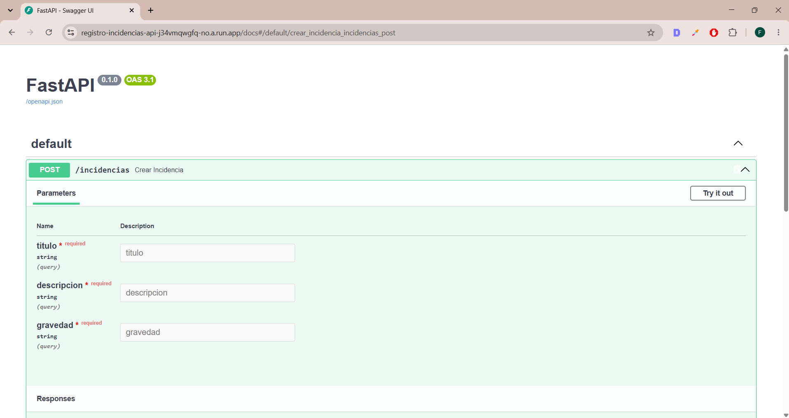
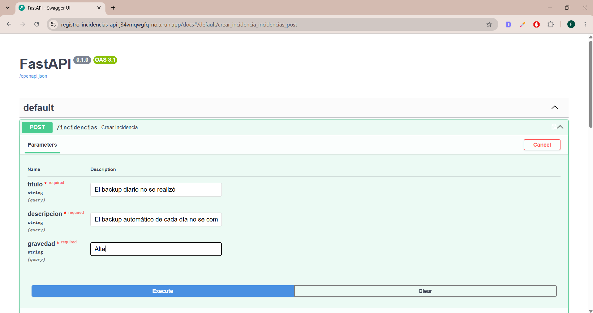
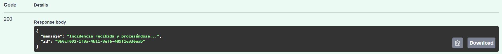
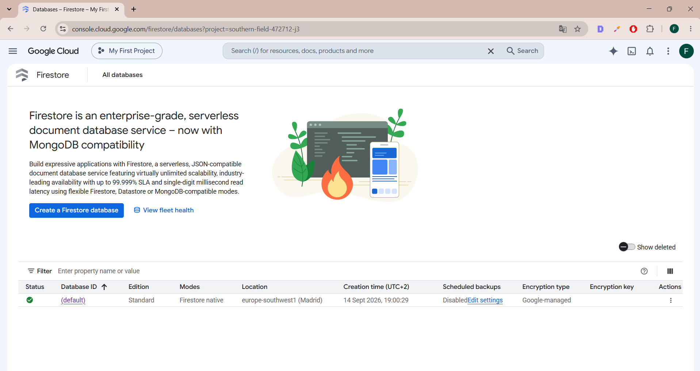
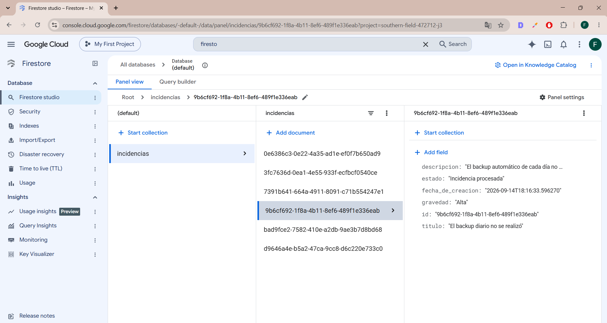
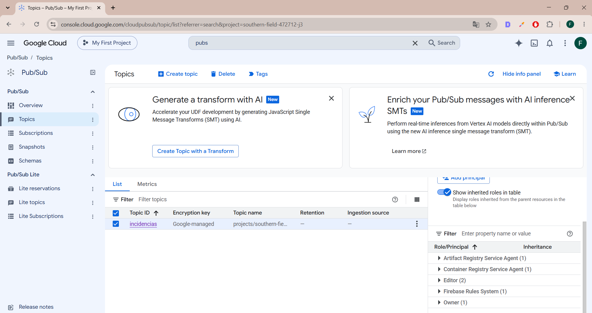
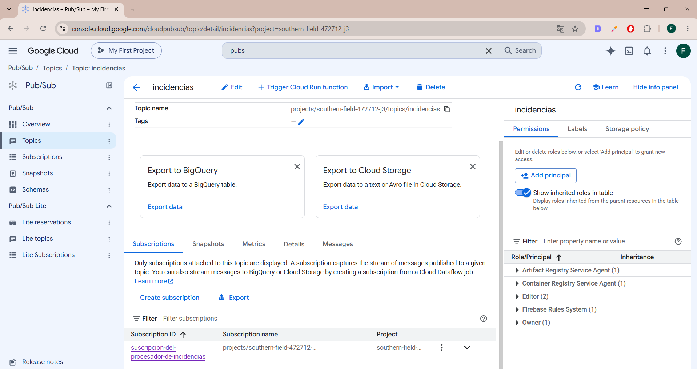
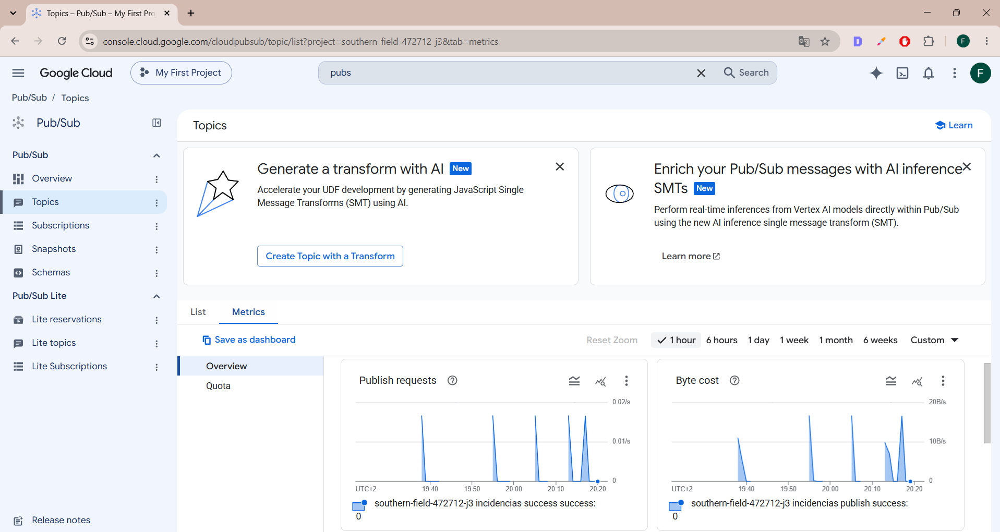
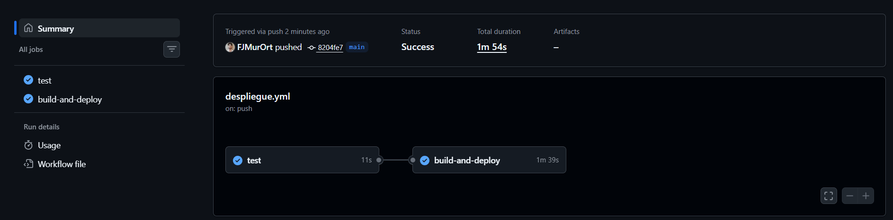

# Registro de Incidencias con Eventos (Terraform, Pub/Sub, Cloud Run, Firestore)

Este proyecto es un sistema que registra incidencias usando una arquitectura basada en eventos en GCP. Está desplegado en Google Cloud, con Pub/Sub, Firestore y Cloud Run.

## 💡 La idea

Aquí no hay solo una API haciendolo todo. Hay sistemas separados que se comunican a través de una cola de mensajes:

1. El primer sistema es la API, la que recibe la incidencia y responde publicando el mensaje
2. El segundo sistema, el procesador de las incidencias, recoge ese mensaje, lo gestiona y lo guarda en la base de datos de FireStore

## ⚙️ ¿Qué hace? ¿Cómo es el flujo?

1. Envío una incidencia a la API (título, descripción, gravedad)
2. La API me responde al instante con un ID, y publica el mensaje en Pub/Sub
3. Pub/Sub entrega ese mensaje al procesador de incidencias
4. Y es el procesador quien lo marca como procesado y lo guarda en la base de datos de Firestore en GCP

A diferencia del acceso público al que se tiene a la API, al procesador no se tiene dicho acceso porque solo Pub/Sub debe poder llamarlo. Por esta razón, le dí acceso únicamente con un service account específica, para que nadie pudiese interactuar con el segundo sistema, es decir, el procesador de incidencias.

## 📸 Capturas











## 📁 La estructura del proyecto

```
registro-incidencias-gcp/
├── api/ # recibe incidencias y las publica en Pub/Sub
├── procesador/ # recibe los mensajes y los guarda en Firestore
├── terraform/ # toda la infraestructura como código
├── .github/workflows/ # el pipeline de CI/CD
└── README.md
```

## ⚙️ Si quieres probarlo tú mismo

1. Activa las APIs:
```bash
   gcloud services enable run.googleapis.com artifactregistry.googleapis.com pubsub.googleapis.com firestore.googleapis.com
```
2. Crea los recursos que también vas a necesitar con Terraform:
```bash
   cd terraform
   terraform init
   terraform apply
```
3. Configura los secretos `GCP_SA_KEY` y `GCP_PROJECT_ID` en tu repositorio de GitHub para tener acceso a GCP
4. Haz un push y el pipeline se encargará de construir y desplegar los servicios

## 🛠️ Tecnologías que se han usado

- Python (FastAPI)
- Terraform
- Docker
- GitHub Actions
- Cloud Run
- Pub/Sub
- Firestore
